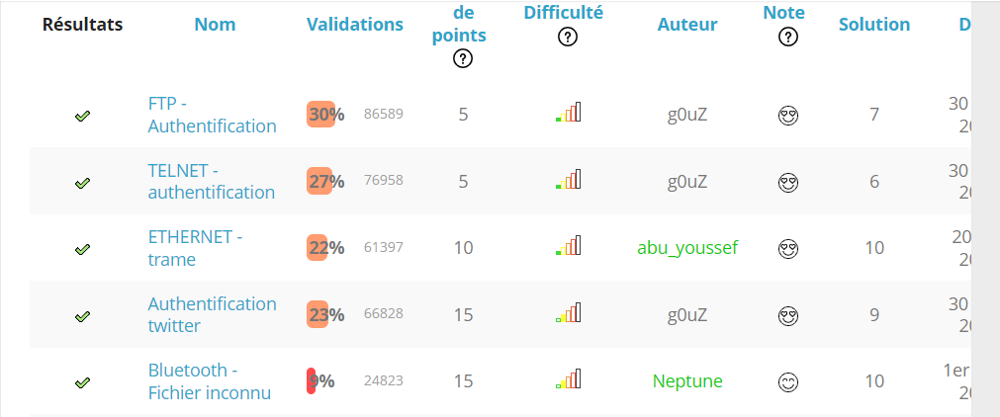
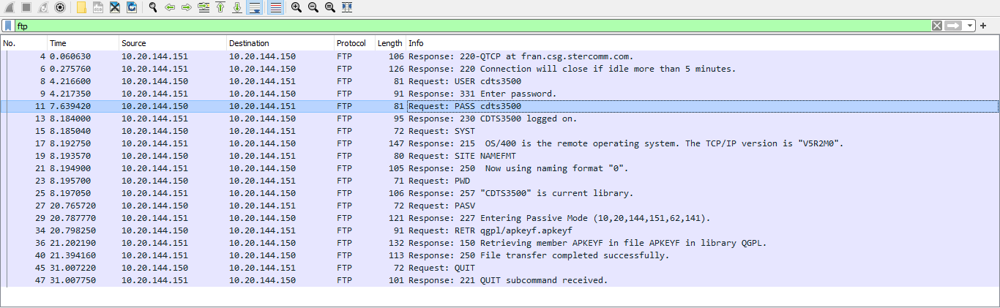
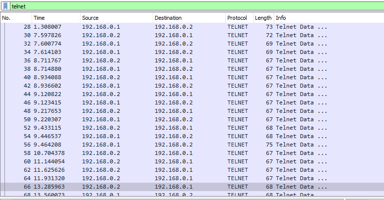
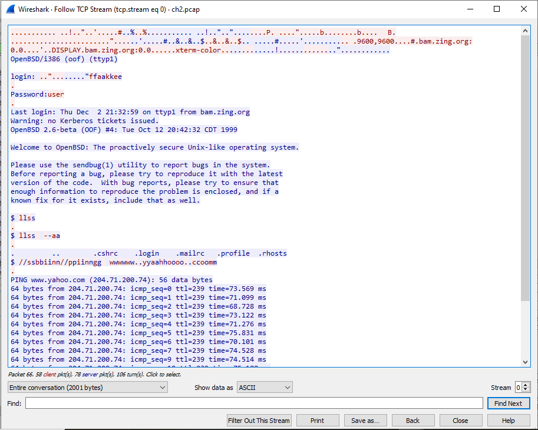
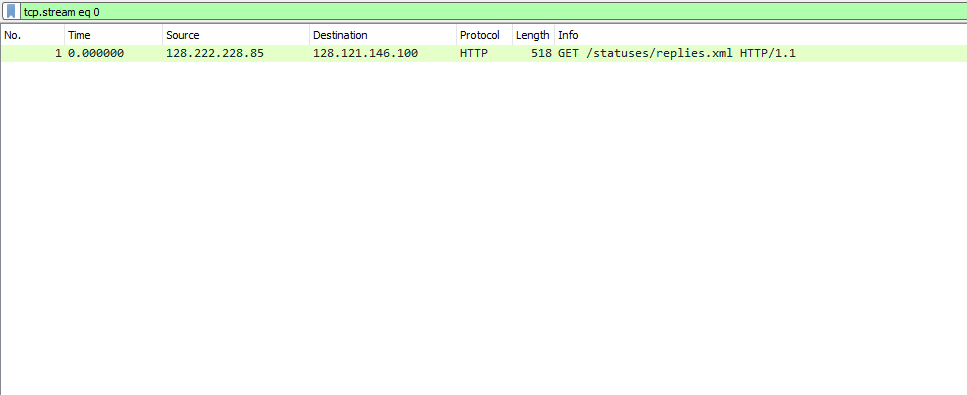
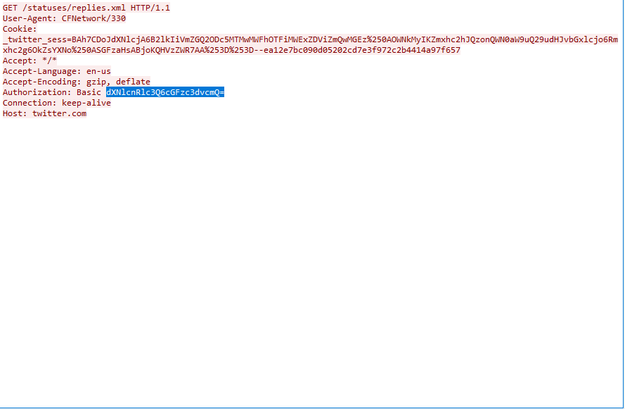
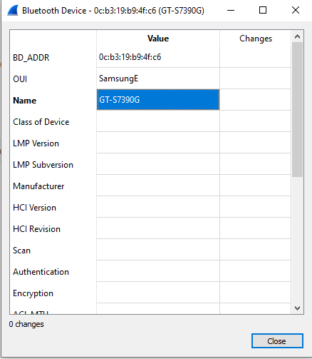

# Root-me | Solution



## Sujet:
>https://l.facebook.com/l.php?u=https%3A%2F%2Fwww.root-me.org%2Ffr%2FChallenges%2F%3Ffbclid%3DIwAR1dq29v916wfq4iIW7cvKrNzHJBm-jsO01OWcQQBzFaVnka7uhk3K89GZQ&h=AT3S7-THV0BtoBIvgnB0ZUT7l6gJdc-bso_EZlWEzbIPwGstpJtF4qr3TmR8JCgT-c92KzzkZDRh6d3zlT3ZRSGFQJEkOI2NaH5P2ZKf8l2OgRDK3pj7TbKaYm0HYolry2NdOQ

------------------
## CHALLENGES:
### FTP - Authentification
- on ouvre le boutton "démmarer le challenge" dans une nouvelle onglet, cela telecharge un fichier chi.pcap
- on l'ouvre avec "Wireshark"
- on filtre le trafique par protocole FTP
- On voix tout de suite le mots de passe sur ce que j'ai séléctionné

illustration: 


> ==> cdts3500

### TELNET - authentification
- on ouvre le boutton "démmarer le challenge" dans une nouvelle onglet, cela telecharge un fichier ch2.pcap
- on l'ouvre avec "Wireshark"
- on filtre le trafique par protocole TELNET

illustration 1: 


- On séléctionne tous et "CTRL + ALT + SHIFT + T (follow --> TCP Steam)
- On a le mots de passe susr le ligne qu'il y a : password: user

illustration2: 


> ==> user


### ETHERNET - trame
- on ouvre le boutton "démmarer le challenge" dans une nouvelle onglet, cela donne un code en hex
```sh
00 05 73 a0 00 00 e0 69 95 d8 5a 13 86 dd 60 00
00 00 00 9b 06 40 26 07 53 00 00 60 2a bc 00 00
00 00 ba de c0 de 20 01 41 d0 00 02 42 33 00 00
00 00 00 00 00 04 96 74 00 50 bc ea 7d b8 00 c1
d7 03 80 18 00 e1 cf a0 00 00 01 01 08 0a 09 3e
69 b9 17 a1 7e d3 47 45 54 20 2f 20 48 54 54 50
2f 31 2e 31 0d 0a 41 75 74 68 6f 72 69 7a 61 74
69 6f 6e 3a 20 42 61 73 69 63 20 59 32 39 75 5a
6d 6b 36 5a 47 56 75 64 47 6c 68 62 41 3d 3d 0d
0a 55 73 65 72 2d 41 67 65 6e 74 3a 20 49 6e 73
61 6e 65 42 72 6f 77 73 65 72 0d 0a 48 6f 73 74
3a 20 77 77 77 2e 6d 79 69 70 76 36 2e 6f 72 67
0d 0a 41 63 63 65 70 74 3a 20 2a 2f 2a 0d 0a 0d
0a
```
- on covertie l'hex en text par [base 16 decode]: https://simplycalc.com/base16-decode.php
- On obtient ensuite une code en base 64 
```sh
�s ��ài•ØZ†Ý`�?���›@&S��`*¼��?��ºÞÀÞ AÐ�B3��?�����–t�P¼ê}¸�Á?×€�áÏ ��
	>?i¹¡~ÓGET / HTTP?/1.1
Authorizat?ion: Basic Y29uZ?mk6ZGVudGlhbA==
?
User-Agent: Ins?aneBrowser
Host?: www.myipv6.org?
Accept: */*

?
```
- on decode Y29uZ?mk6ZGVudGlhbA==  par [base 64 decode]: https://www.base64decode.org/

> ==> confi:dential

### Authentification twitter
- on ouvre le boutton "démmarer le challenge" dans une nouvelle onglet, cela telecharge un fichier ch3.pcap
- on l'ouvre avec "Wireshark"
illustration 1:

- On séléctionne tous et "CTRL + ALT + SHIFT + T (follow --> TCP Steam)
illustration 2:

- - on decode dXNlcnRlc3Q6cGFzc3dvcmQ=  par [base 64 decode]: https://www.base64decode.org/
> ==> password


### Bluetooth 
- on ouvre le boutton "démmarer le challenge" dans une nouvelle onglet, cela telecharge un fichier ch18.bin
- on l'ouvre avec "Wireshark"
- On va dans l'option wireless --> Bluetooth Devices --> clic droite
illustration 1:

- On trasmet les données en forme addresse Mac  avec le nom du telephone 0C:B3:19:B9:4F:C6GT-S7390G
- On encrypt 0C:B3:19:B9:4F:C6GT-S7390G par : https://www.sha1.fr/
> ==> c1d0349c153ed96fe2fadf44e880aef9e69c122b

## License

C

**Tiana-Finaritra**
